# 42\_born2beroot

## Content
- 	[Historic :clock7:](#historic-clock7)
-	[Target](#target)
-	[CentOS Vs Debian](#centOs-vs-debian)
-	[SELinux Vs AppArmor](#selinux-vs-apparmor)
-	[LVM (Logical Volume Manager)](#lvm)
-	[Creation of the VM](#creation-of-the-vm)
	-	[Misc command](#misc-command)
	-	[sudo](#sudo)
	-	[apt](#apt)
	-	[aptitude](#aptitude)
	-	[ssh](#ssh)
	-	[AppArmore](#apparmor)
	-	[ufw](#ufw)
	-	[ifconfig](#ifconfig)
	-	[pam](#pam)
	-	[monitoring script](#monitoring-script)
	-	[ip fix](#ip-fix)
-	[Defend yourself](#defend-yourself)
-	[Sources](#sources)
-	[Tips](#tips)

---

## Historic :clock7:
[Go to content](#content)
|Date _YYYY-MM-DD_|Description|
|:-|:-|
|2022-05-04|Init|

## Target
Install a LINUX server with user restriction

### Mandatory part
- [x]	ssh
	- [x]	on the port 4242 only
	- [x]	not possible with root
- [x]	firewall UFW
	- [x]	installation
	- [x]	port only 4242
- [x]	hostname = abarrier42
- [x]	password policy
	- [x]	expiration  = 30 days
	- [x]	days before to change = 2 days
	- [x]	warning expiration = 7 days
	- [x]	length = 10 char
	- [x] 	minimum capitale letter = 1 char
	- [x]	minimum number  = 1
	- [x]	identical char forbidden >= 3
	- [x]	no user name
	- [x]	minimum unknown char from the previou password = 7  :warning: _not applicable for root_
	- [x]	previsous rules must be applied for root
	- [x]	change pwdquality.conf
- [x]	change password for root and abarrier
	- [x] root = Iamr1o2o3t
	- [x] abarrier = IamA1b2a3rrier
- [x]	sudo
	- [x]	installation
	- [x]	try to connect = 3
	- [x]	error message if wrong password
	- [x]	log file saved into '/var/log/sudo/'
	- [x]	TTY activated
	- [x]	specify some restrictive path
- [x]	new user
	- [x]	abarrier
	- [x]	group : user42, sudo
- [x]	script 'monitoring.sh'
	- [x]	change calculation sur df
- [x]	change dynamic IP to fixed IP

---

### Bonus part
- [x]	wordpress
- [x]	ligthtpd
- [x]	mariadb
- [x]	php
- [x]	new services

---

## CentOS Vs Debian
CentOS
*	Supports the minor version upgrades but not the major version upgrades such as from CentOS 6 to CentOS 7 or CentOS 8
*	Major version 10-year lifespan
*	CentOS commercial support is not provided directly from the CentOS Project (or Red Hat), but is available through 3rd parties, such as OpenLogic

Debian
*	Debian’s ability to upgrade from one stable release to another, such as from Debian 9 Stretch (stable) to Debian 10 Buster (stable)
*	Major version every 2 years with 3 years of full support and an additional 2 years of LTS (Long Term Support) for a 5-year lifespan
*	Debian is primarily community supported, including offering a bug tracker

---

## SELinux Vs AppArmor
SELinux
*	Developped by NSA
*	Use file system by defining extended properties.  Example: `ls -Z /etc/passwd`
*	More complex to configure it than AppArmor

AppArmor
*	Use profile security for each program to restrinct the access to path
*	Mode "enforcing" = Apply rules adn give feedback about violation
*	Mode "complaining" = Log the violation without stop it
*	More easier to configure it than SELinux

---

## LVM
### Lexic
LVM = Logical Volume Manager
partition
*	Section from storage support (hard-disk, SSD, memory flash).
partitioning
*	Divide a storage support to let the explotation system process informations separatively
	<table>
		<thead>
			<tr>
				<th>OS</th>
				<th>Sequence</th>
				<th>Example</th>
			</tr>
		</thead>
		<tbody>
			<tr>
				<td>Windows</td>
				<td>letters + ':'</td>
				<td>C:</td>
			</tr>
			<tr>
				<td>MacOs</td>
				<td>diskNsM
					<ul>
						<li>N = support number</li>
						<li>M = partition number from the support</li>
					</ul>
				</td>
				<td>disk2s3</td>
			</tr>
			<tr>
				<td>Unix<br>Gnu/Linux</td>
				<td>sdXN
					<ul>
						<li>X = support letter</li>
						<li>M = partition number from the support</li>
					</ul>
				</td>
				<td>sdb3</td>
			</tr>
		</tbody>
	</table>
*	Physical Volume (PV): represents the hardware (disks, partitions).
*	Volume Group (VG): reprents several 'Physical Volume' into virtual one.
*	Logical Volume (LV): represents the virtual partitions of the 'Volume Group'.
*	Physical Extented (PE): represents disks blocks (more or less 4Mo).

---

### Why partitioning ?
*	Less impact in case of formatting if severals partitions, only one can be affected by this process.
	*	To avoid saturating system partitions for dedicated services generating lot of data. Example:
		*	Files server = Significant volume for `srv` or `/var/ftp/`.
		*	Log server = Significant volume for `/var/log`.

**:warning: _Some Debian distribution requires execution right for `/var/lib/dpkg`._**

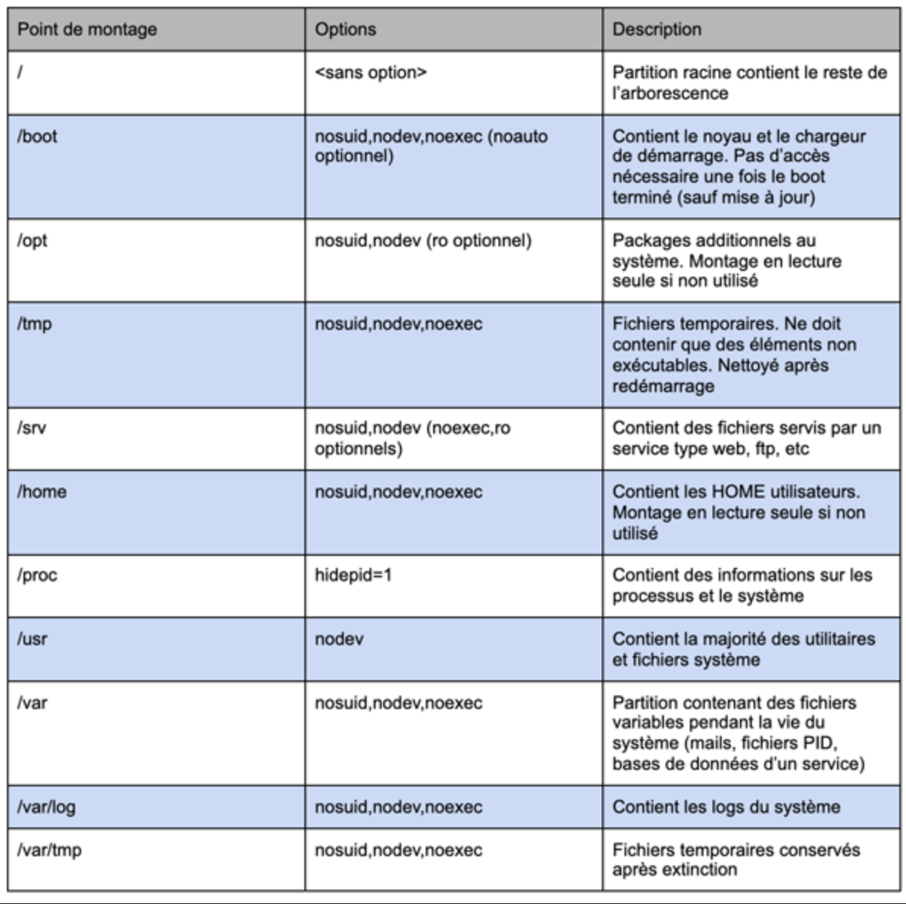

**:warning: _`/boot` is used by malware. If possible, `/boot` must be used only by the user `root`._**

---

### Why LVM ?
Useful to partitioning different physical support to virtual one.
Example :
2 disks of 250Go
Needing of 470Go:
*	20Go for the system
*	150Go for files
*	150Go for movies
*	150Go for video games
Problem: we must separate of one category to get following installation:
*	250Go = 20Go (system) + 150Go (files) + 80Go (movies)
*	250Go = 150Go (vide games) + 70Go (movies) + 30Go (free)
By usign LVM, it is possible to create one 'volume group' of 500Go and 4 'logical volume' as the needing.

---

### Basic commands with LVM
**:warning: _Every commands must be executed with the user 'root'. Example: sudo lvs_**

`pvs` display 'PV' informations  
`vgs` display 'VG' informations  
`lvs` display 'LV' informations  
`lvdisplay` display the path of the 'PV'  
`fdisk` or `gparted` create empty LVM partition  
`pvcreate /dev/sdXX-` create a 'PV' on the disk. Check it by usign `sudo pvs`  
`vgextend my-virtual-group /dev/sdXX` extend the 'VG' to the disk

Extend the 'LV' and resize the partition
```
lvextend -l +100%FREE -r /dev/my-virtual-group/root
lvextend -l +50%FREE r /dev/my-virtual-group/root
lvextend -L +10G -r /dev/my-virtual-group/root
```

---

## Creation of the VM
### Partition overview
Total VM disk volume = 14G
|MOUNTPOINT	|VOLUME SIZE	|VOLUME	|
|:----------|:-------------:|:-----:|
|root		|33%			|5G		|
|swap		|8%				|2G		|
|home		|16%			|2G		|
|var		|10%			|1.3G	|
|srv		|10%			|1.2G	|
|tmp		|10%			|1.5G	|
|var--log	|13%			|1G		|

---

### Installation process
<ol>
	<li>Download Debian ISO file on the official Website</li>
	<li>Launch VirtualBox</li>
	<li>Activate the menu <strong>Tools</strong></li>
	<li>Select the button <strong>New</strong></li>
	<ul>
		<li>Define the name as: <login> + 42<br>Example: abarrier42</li>
		<li>Define the VM installation directory. At 42, define the path <strong>sgoinfre</strong> according to your login.</li>
		<li>Define the type <strong>Linux</strong></li>
		<li>Define the <strong>Debian</strong> version</li>
		<li>Click on the button <strong>Next</strong></li>
		<li>Define the RAM volume</li>
		<li>Select the option <strong>Create a virtual disk now</strong></li>
		<li>Define the file extension <strong>VDI (VirtualBox Disk Image)</strong></li>
		<li>Define a fixed volume</li>
		<li>Define the virtual volume disk. <strong>At 42, in sgoinfre directory, the maximum size is 30 Gio</strong></li>
	</ul>
	<li>Select the VM and start it</li>
	<li>Select "Install"</li>
	<li>Define language installation/keyboard</li>
	<li>Define hostname `abarrier42`</li>
	<li>Define empty domain</li>
	<li>Define root password `Admin`</li>
	<li>Define new user `abarrier`</li>
	<li>Define username `abarrier`</li>
	<li>Define user password `Abarrier`</li>
	<li>Define time zone</li>
	<li>Select mode `Manual`</li>
	<li>Select the disk</li>
	<li>Partition the disk</li>
	<li>Select "FREE" partition and press "enter"</li>
	<li>Select "Create new partition</li>
	<ul>
		<li>Define "size" = 700MB</li>
		<li>Select "primary"</li>
		<li>Select "begining"</li>
		<li>Define "use as" = ext2</li>
		<li>Define "mountpoint" = boot</li>
		<li>Define "bootable flag" = on</li>
		<li>Select "done..."</li>
	</ul>
	<li>Select "FREE" partition and press "enter"</li>
	<li>Select "Create new partition</li>
	<ul>
		<li>Define "size" = 14G</li>
		<li>Select "logical"</li>
		<li>Define "use as" = logical volume for encryption</li>
		<li>Select "done..."</li>
	</ul>
	<li>Select "configure encrypted volumes"<br>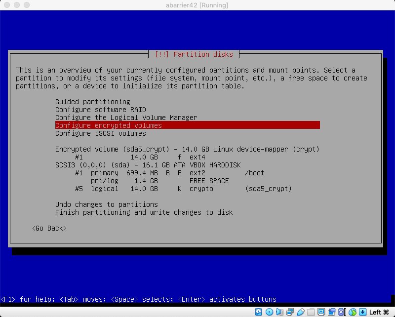</li>
	<ul>
		<li>Select "create encrypted volumes"</li>
		<li>Select the crypted partition</li>
		<li>Select "finish"</li>
		<li>Define "passphrase" = Admin</li>
	</ul>
	<li>Select "configure the logical volume manager"<br>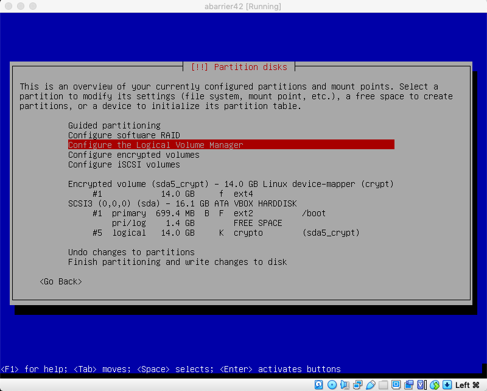</li>
	<ul>
		<li>Select "create colume group"<br>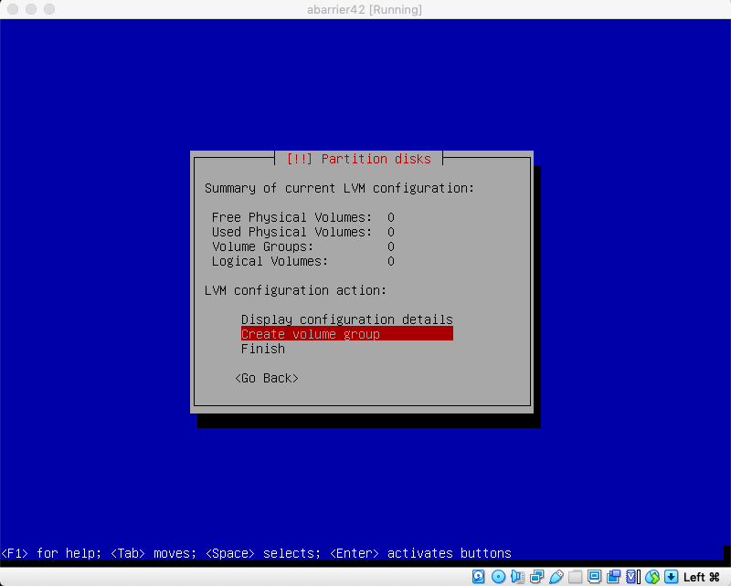</li>
		<li>Define the name "LVMGroup"</li>
		<li>Select the crypted partition<br>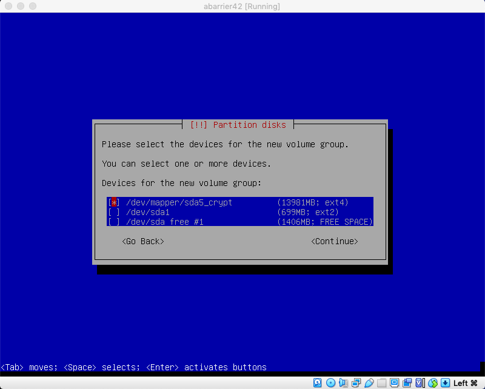</li>
		<li>According to the above table, create every partition by using "create logical volume" and selecting the volume group<br>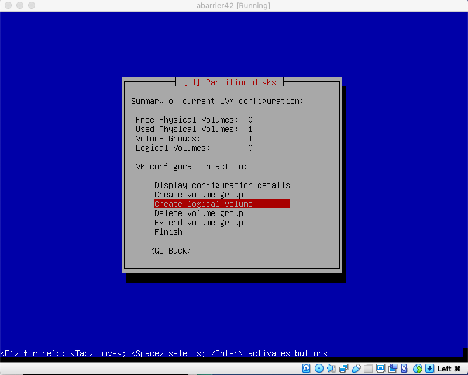<br>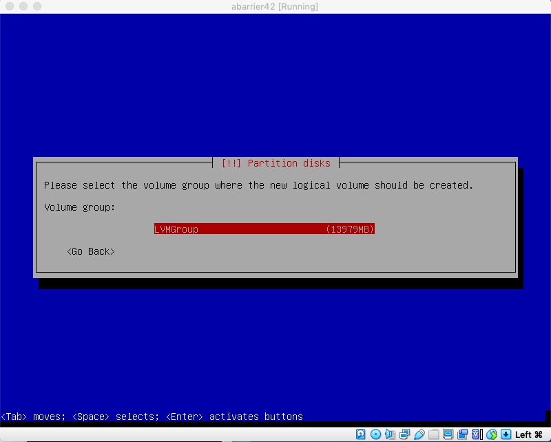</li>
		<table>
			<thead>
				<tr>
					<th>Partition name</th>
					<th>Size partition</th>
					<th>Mount point</th>
					<th>Use as</th>
				</tr>
			</thead>
			<tbody>
				<tr>
					<td>home</td>
					<td>2G</td>
					<td>/home</td>
					<td>ext4</td>
				</tr>
				<tr>
					<td>root</td>
					<td>5G</td>
					<td>/root</td>
					<td>ext4</td>
				</tr>
				<tr>
					<td>srv</td>
					<td>1.2G</td>
					<td>/srv</td>
					<td>ext4</td>
				</tr>
				<tr>
					<td>swap</td>
					<td>2G</td>
					<td>N?A</td>
					<td>swap area</td>
				</tr>
				<tr>
					<td>tmp</td>
					<td>1.5G</td>
					<td>/tmp</td>
					<td>ext4</td>
				</tr>
				<tr>
					<td>var</td>
					<td>1.3G</td>
					<td>/var</td>
					<td>ext4</td>
				</tr>
				<tr>
					<td>var--log</td>
					<td>1G</td>
					<td>/var--log (manually)</td>
					<td>ext4</td>
				</tr>
			</tbody>
		</table>
		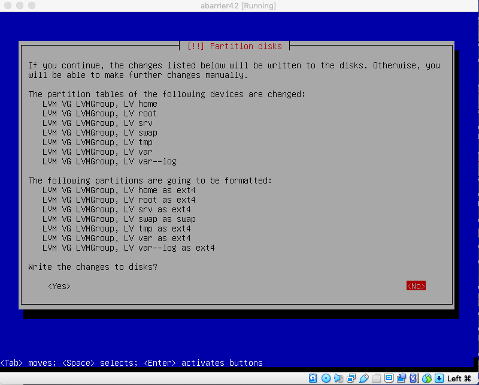<br>
		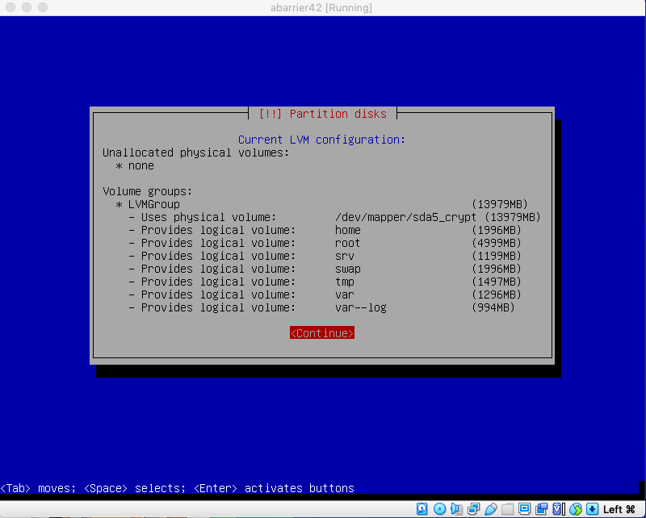<br>
		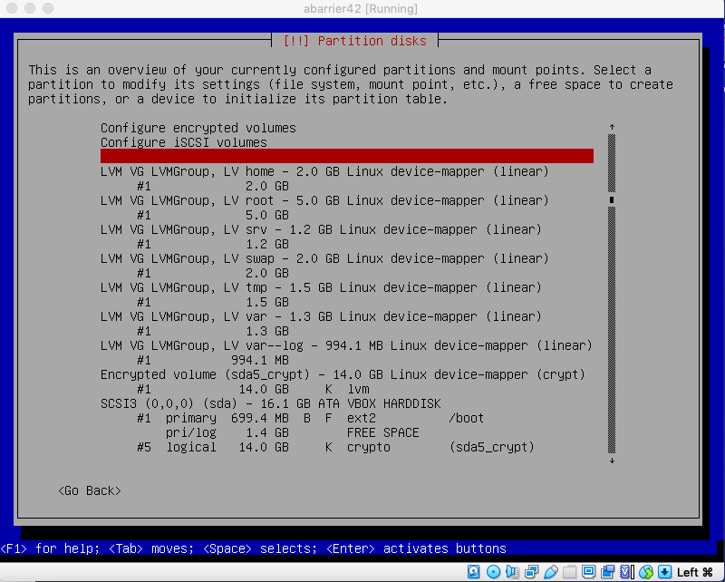
	</ul>
	<li>Select "Finsih partitioning...:</li>
	<li>Do not search additional packages</li>
	<li>Accept network mirror</li>
	<li>Select "de.debian.org"</li>
	<li>Define empty proxy</li>
	<li>Do not accpet usage survey</li>
	<li>Deselect every package<br>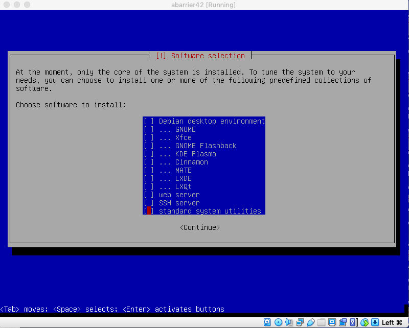</li>
	<li>Accept GRUB Boot installation<br>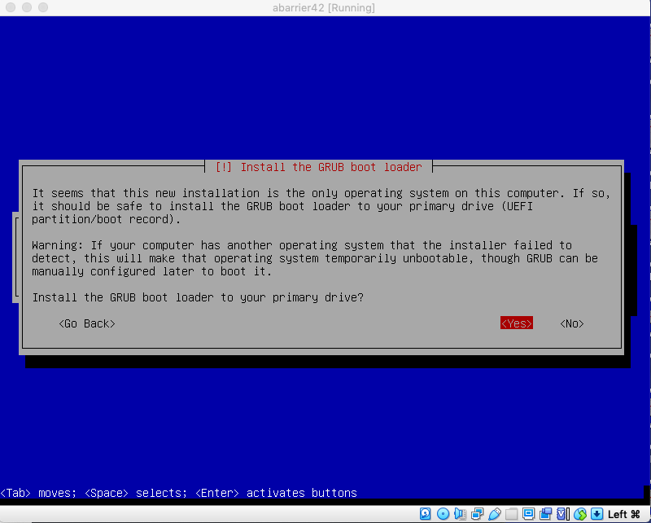</li>
	<li>Select the sda<br>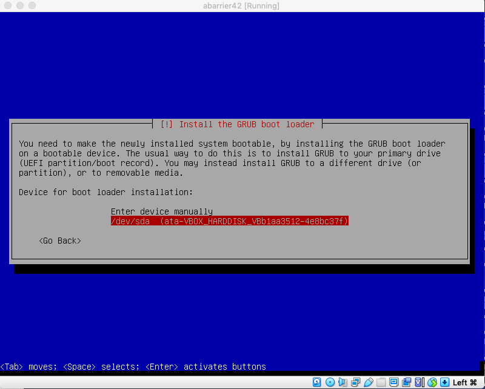</li>
	<li>Finalize the installation<br>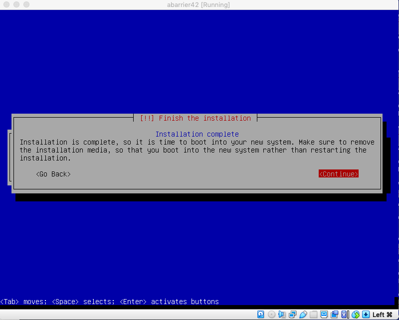</li>
</ol>

---

### Bash profile management

`. ~/.bashrc` reload bash profile

---

### Misc command
#### getent
##### Definition
The getent command displays entries from databases supported by the Name Service Switch libraries, which are configured in /etc/nsswitch.conf. If one or more key arguments are provided, then only the entries that match the supplied keys will be displayed. Otherwise, if no key is provided, all entries will be displayed (unless the database does not support enumeration).

##### Usage
`getent passwd` == `cat /etc/passwd` display user password list  
`getent group` display group list  
`getent hosts` display hosts list  
`getent networks` display networks list  
`getent services` display service

#### compgen
##### Definition>
N/A

##### Usage
`compgen -a` List all aliases  
`compgem -A <function>` List all functions that you could run  
`compgen -e` List all environment variable  
`compgen -c` List all commands that you could run  
`compgen -k` Show shell reserved keywords  
`compgen -u` List all users  
`compgen -ac [command/aliases]` See all available commands/aliases starting with 'ls'

---

#### User management
##### Add new user
```
su
adduser username
useradd username
```

---

##### Delete user
```
su
deluser [--remove-home] username
userdel [--remove] username
```

---

##### Add group
```
su
groupadd groupname
addgroup groupname
```

---

##### Delete group
```
su
groupdel groupname
delgroupname
```

---

##### Add user to a group
Option definition:
`a` = append  
`G` = group  
```
su -
usermod -aG sudo username
```

---

##### Display list of user
```
cat /etc/passwd | cut -d: -f1 | uniq | sort
getent passwd | cut -d: -f1 | uniq | sort
compgen -u
```

---

##### Display list of group
```
cat /etc/group | cut -d: -f1 | uniq | sort
getent group | cut -d: -f1 | uniq | sort
compgen -g
```

---

##### Change password
```
sudo passwd username
```

---

##### Check password expiry
[see chapter "pam"](#pam)

---

##### Connect as user
```
su username
```

---

##### Disconnect as user
```
exit
```

---

### sudo
#### Installation
```
su
apt update
apt-get install sudo
```

---

#### File(s)
/etc/sudoers
/etc/sudoers.d/b2bconfig

#### Edit configuration file
```
sudo update-alternatives --config editor
su
sudo visudo
```
**:warning: _Avoid to edit directly visudo because it can be resetted after an upgrade of debian_**
In that case, it is recommended to create a separate file stored in /etc/sudoers.d
```
sudo /etc/sudoers/b2bconfig
```

---

#### Configuration lexic
EBNF is a concise and exact way of describing the grammar of a language. Each EBNF definition is made up of production rules. E.g.,
`symbol ::= definition | alternate1 | alternate2 ...`  
Each production rule references others and thus makes up a grammar for the language. EBNF also contains the following operators, which many readers will recognize from regular expressions. Do not, however, confuse them with ''wildcard'' characters, which have different meanings.
`?`      Means that the preceding symbol (or group of symbols) isoptional.  That is, it may appear once or not at all.  
`\*` Means that the preceding symbol (or group of symbols) may appear zero or more times.  
`+` Means that the preceding symbol (or group of symbols) may appear one or more times.  
Parentheses may be used to group symbols together. For clarity, we will use single quotes ('') to designate what is a verbatim character string (as opposed to a symbol name).

|NAME|PREFIX|
|:---|:---|
|user_ids|#|
|system group names and ids|% or %#|
|netgroups|+|
|non-Unix group names and ids|%: or %:#|

*Example:*
```
User_List ::= User |
        User ',' User_List
User ::= '!'* user name |
   '!'* #uid |
   '!'* %group |
   '!'* %#gid |
   '!'* +netgroup |
   '!'* %:nonunix_group |
   '!'* %:#nonunix_gid |
   '!'* User_Alias
```

#### Configuration
```
sudo visudo
Defaults	editor="/bin/vim"
Defaults	passwd_tries=3
Defaults	badpass_message="Wrong password"
Defaults	requiretty
Defaults	logfile="/var/log/sudo/sudo.log"
Defaults	log_input,log_output
Defaults	env_reset
Defaults	mail_badpass
Defaults	secure_path="/usr/local/sbin:/usr/local/bin:/usr/sbin:/usr/bin:/sbin:/bin"
# Host alias specification
# User alias specification
# Cmnd alias specification
# User privilege specification
abarrier	ALL=(ALL:ALL) ALL
```

#### Usage
`sudo apt search package-name` search a package  
`su - $USER` or changing group with `newgrp sudo`

---

### apt
#### Definition
Apt or Advanced Packaging Tool is a free and open source software which gracefully handles software installation and removal.
Apt is whole command line with no GUI.
Invoked from command line along with specifying the name of package to be installed, it finds that package in configured list of sources specified in `/etc/apt/sources.list` along with the list of dependencies for that package and sorts them and automatically installs them along with the current package thus letting user not to worry of installing dependencies.

#### Installation
Automatically installed with Debian.

#### Usage
`sudo apt update` update package index.  
`sudo apt-get install packagename` install a package

---

### aptitude
#### Definition
Aptitude is front-end to advanced packaging tool which adds a user interface to the functionality, thus allowing a user to interactively search for a package and install or remove it. Initially created for Debain, Aptitude extends its functionality to RPM based distributions as well.

#### Installation
```
su
apt update
apt install aptitude
```

#### Usage
`sudo aptitude` display GUI  
`+` select a package  
`g` install selected package  
`aptitude search package-name` search a package

---

### ssh
#### Definition
Secure Shell (SSH) is a cryptographic network protocol for operating network services securely over an unsecured network.[1] Typical applications include remote command-line, login, and remote command execution, but any network service can be secured with SSH. 

#### Installation
```
sudo aptitude
\<select openssh-server>
```

#### File(s)
/etc/ssh/sshd_config

#### Configuration
```
#	$OpenBSD: sshd_config,v 1.103 2018/04/09 20:41:22 tj Exp $
# This is the sshd server system-wide configuration file.  See
# sshd_config(5) for more information.
# This sshd was compiled with PATH=/usr/bin:/bin:/usr/sbin:/sbin
# The strategy used for options in the default sshd_config shipped with
# OpenSSH is to specify options with their default value where
# possible, but leave them commented.  Uncommented options override the
# default value.
Include /etc/ssh/sshd_config.d/*.conf
Port 4242
#AddressFamily any
#ListenAddress 0.0.0.0
#ListenAddress ::
#HostKey /etc/ssh/ssh_host_rsa_key
#HostKey /etc/ssh/ssh_host_ecdsa_key
#HostKey /etc/ssh/ssh_host_ed25519_key
# Ciphers and keying
#RekeyLimit default none
# Logging
#SyslogFacility AUTH
#LogLevel INFO
# Authentication:
#LoginGraceTime 2m
#PermitRootLogin prohibit-password
PermitRootLogin no
#StrictModes yes
MaxAuthTries 4
#MaxSessions 10
#PubkeyAuthentication yes
# Expect .ssh/authorized_keys2 to be disregarded by default in future.
#AuthorizedKeysFile	.ssh/authorized_keys .ssh/authorized_keys2
#AuthorizedPrincipalsFile none
#AuthorizedKeysCommand none
#AuthorizedKeysCommandUser nobody
# For this to work you will also need host keys in /etc/ssh/ssh_known_hosts
#HostbasedAuthentication no
# Change to yes if you don't trust ~/.ssh/known_hosts for
# HostbasedAuthentication
#IgnoreUserKnownHosts no
# Don't read the user's ~/.rhosts and ~/.shosts files
#IgnoreRhosts yes
# To disable tunneled clear text passwords, change to no here!
#PasswordAuthentication yes
#PermitEmptyPasswords no
# Change to yes to enable challenge-response passwords (beware issues with
# some PAM modules and threads)
ChallengeResponseAuthentication no
# Kerberos options
#KerberosAuthentication no
#KerberosOrLocalPasswd yes
#KerberosTicketCleanup yes
#KerberosGetAFSToken no
# GSSAPI options
#GSSAPIAuthentication no
#GSSAPICleanupCredentials yes
#GSSAPIStrictAcceptorCheck yes
#GSSAPIKeyExchange no
# Set this to 'yes' to enable PAM authentication, account processing,
# and session processing. If this is enabled, PAM authentication will
# be allowed through the ChallengeResponseAuthentication and
# PasswordAuthentication.  Depending on your PAM configuration,
# PAM authentication via ChallengeResponseAuthentication may bypass
# the setting of "PermitRootLogin without-password".
# If you just want the PAM account and session checks to run without
# PAM authentication, then enable this but set PasswordAuthentication
# and ChallengeResponseAuthentication to 'no'.
UsePAM yes
#AllowAgentForwarding yes
#AllowTcpForwarding yes
#GatewayPorts no
X11Forwarding yes
#X11DisplayOffset 10
#X11UseLocalhost yes
#PermitTTY yes
PrintMotd no
#PrintLastLog yes
#TCPKeepAlive yes
#PermitUserEnvironment no
#Compression delayed
#ClientAliveInterval 0
#ClientAliveCountMax 3
#UseDNS no
#PidFile /var/run/sshd.pid
#MaxStartups 10:30:100
#PermitTunnel no
#ChrootDirectory none
#VersionAddendum none
# no default banner path
#Banner none
# Allow client to pass locale environment variables
AcceptEnv LANG LC_*
# override default of no subsystems
Subsystem	sftp	/usr/lib/openssh/sftp-server
# Example of overriding settings on a per-user basis
#Match User anoncvs
#	X11Forwarding no
#	AllowTcpForwarding no
#	PermitTTY no
#	ForceCommand cvs server
```

#### Usage
`sudo systemctl status ssh` check ssh service status  
`sudo systemctl restart ssh` restart ssh service (mandatory if modification of configuration files).  
`ssh -p 4242 abarrier@localhost` connect via client machine to the server

if local encoding different between client and server, a warning message can occur.
```
perl: warning: Setting locale failed.
perl: warning: Please check that your locale settings:
	LANGUAGE = "en_US:en",
	LC_ALL = (unset),
	LC_TERMINAL = "iTerm2",
	LC_CTYPE = "UTF-8",
	LANG = "en_US.UTF-8"
    are supported and installed on your system.
perl: warning: Falling back to a fallback locale ("en_US.UTF-8").
```
It warns the user about difference of local encoding.  
`local -a` display  what encoding are they on the server.  
Then  
`LANG="en_US.UTF-8" ; ssh -p 4242 abarrier@localhost` connect without local encoding warning  
or  
`echo 'LANG="en_US.UTF-8"' >> .profile && source .profile` change the profile on the client machine

---

### AppArmor
#### Definition
AppArmor is an effective and easy-to-use Linux application security system. AppArmor proactively protects the operating system and applications from external or internal threats, even zero-day attacks, by enforcing good behavior and preventing both known and unknown application flaws from being exploited.

#### Installation
Automatically installed with Debian

#### Usage
`sudo aa-status` or `sudo apparmor_status` display AppArmor status  
`sudo journalctl -fx` display journal of potentially harmful operations

---

### ufw
#### Definition
N/A

#### Installation
```
sudo aptitude
<select ufw>
sudo ufw --version
```

#### Usage
`sudo ufw status verbose` display status  
`sudo ufw status numbered` display status with index of port  
`sudo ufw allow [rule]` add 'allow' rule  
`sudo ufw deny [rule]` add 'deny' rule  
`sudo ufw delete [rule]`delette rule  

---

### ifconfig
#### Definition
ifconfig (interface configuration) is a network management tool. It is used to configure and view the status of the network interfaces in Linux operating systems. With ifconfig, you can assign IP addresses, enable or disable interfaces, manage ARP cache, routes, and more.

#### Installation
```
sudo aptitude
"select net-tools"
```

#### Usage
`sudo ìfconfig` display interface configuration  
`sudo ifconfig -a` display all interface configuration  
`sudo ifconfig <specific network>` display specific interface configuration  
`sudo ifconfig <specifi network> down` disable specific interface configuration  
`sudo ifconfig <specifi network> up` enable specific interface configuration  

---

### pam
#### Definition
N/A

#### Installation
Automatically installed with Debian
But it is recommended to to install additional module
```
sudo aptitude
"select libpam-pwquality"
```

#### File(s)
/etc/pam.d/common-password
/etc/login.defs
/etc/security/pwdquality.conf

#### Configuration
Edit password rules
<table>
	<thead>
		<tr>
			<th>Key</th>
			<th>Description</th>
		</tr>
	</thead>
	<tbody>
		<tr>
			<td>difok=N</td>
			<td>are at least some minimum number of characters in the new password not present in the old password</td>
		</tr>
		<tr>
			<td>retry=N</td>
			<td>total retry</td>
		</tr>
		<tr>
			<td>minlen=N</td>
			<td>minmum length</td>
		</tr>
		<tr>
			<td>lcredit=N</td>
			<td>lower-case</td>
		</tr>
		<tr>
			<td>ucredit=N</td>
			<td>upper-case</td>
		</tr>
		<tr>
			<td>dcredit=N</td>
			<td>numeric (digit)</td>
		</tr>
		<tr>
			<td>ocredit=N</td>
			<td>non-alphanumeric (other)</td>
		</tr>
		<tr>
			<td>minclass=N</td>
			<td>minimum of character type (l/u/d/o case)</td>
		</tr>
		<tr>
			<td>maxrepeat=N</td>
			<td>total authorized repeated character</td>
		</tr>
		<tr>
			<td>maxclassrepeat=N</td>
			<td>reject N consecutive character of the same type</td>
		</tr>
		<tr>
			<td>gecoscheck=N</td>
			<td></td>
		</tr>
		<tr>
			<td>dictcheck=N</td>
			<td></td>
		</tr>
		<tr>
			<td>usercheck=N</td>
			<td>check if USER name is present in the password</td>
		</tr>
		<tr>
			<td>usersubstr=N</td>
			<td></td>
		</tr>
		<tr>
			<td>enforcing=N</td>
			<td></td>
		</tr>
		<tr>
			<td>dictpath=N</td>
			<td></td>
		</tr>
		<tr>
			<td>enforce_for_root=N</td>
			<td>apply the rule for root</td>
		</tr>
		<tr>
			<td>local_users_only=N</td>
			<td></td>
		</tr>
	</tbody>
</table>

Edit common-password
```
password	requisite			pam_pwquality.so retry=3 minlen=10 ucredit=-1 dcredit=-1 maxrepeat=3 usercheck=1 difok=7 enforce_for_root
password	[success=1 default=ignore]	pam_unix.so obscure use_authtok try_first_pass yescrypt minlen=10 # here's the fallback if no module succeeds
password	requisite			pam_deny.so
password	required			pam_permit.so
```

Edit logins rules
```
PASS_MAX_DAYS	30
PASS_MIN_DAYS	2
PASS_WARN_AGE	7
```

#### Usage
`sudo char -l username` check password expiry information  
`sudo chage -M 30 -m 2 -W 7 username` change password expiry  

### monitoring script
#### Definition
N/A

#### File(s)
create monitoring.sh file in /usr/local/bin (see fsh norme)
chmod 755 monitoring.sh to be able to execute it by any user including root

#### Configuration
```
#!/bin/bash
# Architecture
architecture=$(uname -a)
# CPU physical
pCPU=$(nproc --all)
# vCPU
# Source: https://www.datacenters.com/news/what-is-a-vcpu-and-how-do-you-calculate-vcpu-to-cpu
# (Threads x Cores) x Physical CPU = Number vCPU
nThread=$(lscpu | grep '^Thread(s) per core' | awk 'BEGIN { FS = "[:blank:]" } { printf "%d", $3 }')
nCore=$(cat /proc/cpuinfo | grep '^cpu cores' | awk ' { print $4 }')
nCPU=$(lscpu | grep '^CPU(s)' | awk '{ print $2 }')
vCPU=$(((${nThread}*${nCore})*${nCPU}))
# Memory Usage
mem_usage=$(free -m | grep 'Mem' | awk '{ printf "%d/%dMB (%.2f%%)", $3, $2, ($3*100)/$2 }')
# Disk Usage
disk_usage=$(df -h | awk '$NF=="/" { printf "%d/%dG (%s)", $3, $2, $5 }')
# CPU load
#CPUload=$(top -bn 1 | grep '^%Cpu(s)' | awk '{ print $1,$2,$3,$4,$5,$6,$7,$8,$9,$10,$11,$12,$13,$14,$15,$16 }')
CPUload=$(top -bn 1 | grep '^%Cpu(s)' | awk '{ printf "%.2f%%", $2+$4+$6+$12+$14 }')
# Last boot
lastboot=$(uptime --since)
# LVM use
lvmuse="no"
if [ $(lsblk | grep ' lvm ' | wc -l) > 0 ]
then
	lvmuse="yes"
fi
# Connexions TCP
nTCP=$(netstat -an | grep 'ESTABLISHED' | wc -l)
# User log
userlog=$(who | wc -l | uniq)
# Network
ip=$(hostname -I)
mac_address=$(cat /sys/class/net/enp*/address | head -1)
# Sudo
sudo=$(cat /var/log/sudo/sudo.log | awk 'NR%2 { print }' | wc -l)
echo "#Architecture: ${architecture}"
echo "#CPU physical: ${pCPU}"
echo "#vCPU: ${vCPU}"
echo "#Memory Usage: ${mem_usage}"
echo "#Disk Usage: ${disk_usage}"
echo "#CPU load: ${CPUload}"
echo "#Last boot: ${lastboot}"
echo "#LVM use: ${lvmuse}"
echo "#Connexions TCP: ${nTCP} ESTABLISHED"
echo "#User log: ${userlog}"
echo "#Network: IP ${ip} (${mac_address})"
echo "#Sudo: ${sudo} cmd"
```

---

## Defend yourself
### Mandatory
*	ufw
	*	`ufw status numbered` display status
	*	`ufw allow rule` or `ufw allow in/out rule` apply a rule
*	hostname
	*	`hostnamectl` display the hostname
	*	`hostnamectl set-hostname newhostname` & `vim /etc/hosts` change hostname
*	user
	*	`adduser newuser` add new user
	*	`usermod -aG groupname username` add user to a group
	*	`groups username` check group associated to the user
*	password policy
	*	`vim /etc/pam.d/common-password /etc/login.defs` edit login config
	*	`chage -l username` display password expiry
	*	`chage -M 30 -m 2 -d 7 username` change password expiry
	*	`vim /etc/pam.d/common-password` edit passwrod config
	*	`passwd -Sa` display status password foe every user
	*	`passwd username` change user password
*	sudo
	*	`vim /etc/sudoers.f/b2bconfig` edit sudo config
*	cron
	*	`crontab -u username -e` edit crontab of the user
	*	`systemctl disable cron` stop the service cron
		*	f1 = minutes (0 - 59)
		*	f2 = hours (0 - 23)
		*	f3 = day of month (1 - 31)
		*	f4 = month (1 - 12)
		*	f5 = day of week (0 - 6 where 0 is sunday)
*	ssh
	*	`vim /etc/ssh/sshd_config` edit ssh config
	*	connection possible on 4242 only
	*	root can not connect
	*	`ssh -p 4242 username@localhost` connect on the server

### Bonus
*	LVM
	*	`lsblk` display partition
*	lighttpd
	*	`systemctl status lighttpd` display service status
*	mariadb
	*	`systemctl status maria*` display service status
*	Php
	*	`http://localhost/phpmyadmin/` connect on phpmyadmin
*	Wordpress
	*	`systemctl | grep -E 'apache|NGINX'` check forbidden services
	*	`/var/www/html/wordpress` directory of wordpress
	*	`localhost\wordpress\wp-admin`
	*	login = root
	*	password = root
	*	`localhost\wordpress` display the website
*	Service
	*	postfix
		*	`systemctl status postfix` display service status
	*	exim4 is a  Message Transfer Agent (MTA)
		*	`systemctl status exim4` display service status
	*	`/usr/local/bin/monitoring.sh | mail -s monitoring_report abarrier@student.42.fr` send an email

---

### ip fix
#### Definition
N/A

#### File(s)
/etc/network/interfaces
/etc/resolv.conf

#### Configuration
Initial address at 42
inet	10.0.2.15
		10.0.2.0
brd		10.0.2.255
gatw	10.0.2.2
mask	255.255.255.0

Initial configuration of interfaces
```
# This file describes the network interfaces available on your system
# and how to activate them. For more information, see interfaces(5).
source /etc/network/interfaces.d/*
# The loopback network interface
auto lo
iface lo inet loopback
# The primary network interface
allow-hotplug enp0s3
iface enp0s3 inet dhcp
```

To change it, you must
*	`ifconfig -a` know the address defined by VMadapter
*	`route -n` know the gateway

ip fix of interfaces
```
# This file describes the network interfaces available on your system
# and how to activate them. For more information, see interfaces(5).
source /etc/network/interfaces.d/*
# The loopback network interface
auto lo
iface lo inet loopback
# The primary network interface
allow-hotplug enp0s3
#iface enp0s3 inet dhcp
iface enp0s3 inet static
	address 10.0.2.15
	netmask 255.255.255.0
	gateway 10.0.2.2
#	broadcast 10.0.2.255
```

Initial configuration of resolv
```
domain lan
search lan
nameserver 192.168.1.254
```

---

## Bonus
### Installation process
*	Install "lighttpd' by using "aptitude" with dependencies of php, mariadb
*	Install "mariadb-server" by using "aptitude"
*	Execute the command `mysql_secure_installation`
*	change password for root
*	select "yes' for "remove anonymous user"
*	select "no" for "Disallow root login remotely"
*	select "yes" for "Remove test database and acces to it"
*	select "yes" for "Reload privilege tables now"
*	Edit file "/etc/phpmyadmin/config-db.config"
*	Change user and password entries


---

## Sources
### Category: Markdown files
*	https://www.ionos.fr/digitalguide/sites-internet/developpement-web/markdown/
*	https://documentation-snds.health-data-hub.fr/contribuer/guide_contribution/tutoriel_markdown.html#notes-de-bas-de-page

### Category: CentOS/Debian
*	https://www.openlogic.com/blog/centos-vs-debian
*	https://debian-handbook.info/browse/stable/sect.installation-steps.html
*	https://linux.die.net/man/8/usermod
*	http://www.debianadmin.com/users-and-groups-administration-in-linux.html

### Category: LVM
*	https://www.padok.fr/blog/partitionnement-disques-lvm
*	https://perhonen.fr/blog/2012/02/pourquoi-utiliser-lvm-400
*	https://www.youtube.com/watch?v=GEl2S5MI-WU

### Category: sudo
*	https://linux.die.net/man/5/sudoers

### Category: Aptitude vs apt-get
*	https://linuxhint.com/apt-update-command/#:~:text=The%20apt%20update%20command%20is%20used%20to%20update,place%20them%20in%20our%20system%20from%20software%20repositories.
*	https://www.tecmint.com/difference-between-apt-and-aptitude/

### Category: UFW
*	https://debian-facile.org/doc:systeme:ufw
*	https://doc.ubuntu-fr.org/ufw

### Category: SELinux/AppArmor
*	https://www.apparmor.net/
*	https://debian-handbook.info/browse/fr-FR/stable/sect.apparmor.html
*	https://www.phhsnews.com/what-is-apparmor-and-how-does-it-keep-ubuntu-secure2665

### Category: ssh
*	https://wiki.debian.org/fr/SSH

### Category: pam (password)
*	https://deer-run.com/users/hal/sysadmin/pam_cracklib.html
*	https://debian-facile.org/doc:securite:passwd:libpam-pwquality
*	https://www.xmodulo.com/set-password-policy-linux.html
*	https://linux.die.net/man/1/chage
*	https://devconnected.com/how-to-change-user-password-on-debian-10/

### Category: IP
*	https://www.youtube.com/watch?v=lApue7CCji0
*	https://wiki.debian.org/fr/NetworkConfiguration

### Category: net-tools
*	https://linuxize.com/post/ifconfig-command/#:~:text=Linux%20ifconfig%20Command.%20ifconfig%20%28interface%20configuration%29%20is%20a,disable%20interfaces%2C%20manage%20ARP%20cache%2C%20routes%2C%20and%20more.

### Category: user
*	https://www.cyberciti.biz/faq/linux-list-users-command/
*	https://linux.die.net/man/8/userdel

### Category: hostname
*	https://www.cyberciti.biz/faq/how-to-change-hostname-on-debian-10-linux/

### Category: crontab
*	https://debian-facile.org/doc:systeme:crontab
*	https://www.man7.org/linux/man-pages/man5/crontab.5.html
*	https://www.man7.org/linux/man-pages/man1/wall.1.html

### Category:monitoring.sh
*	https://linuxize.com/post/how-to-check-the-kernel-version-in-linux/
*	https://www.man7.org/linux/man-pages/man2/uname.2.html
*	https://averagelinuxuser.com/linux-root-folders-explained/
*	https://linuxhandbook.com/linux-directory-structure/
*	https://www.howtogeek.com/117435/htg-explains-the-linux-directory-structure-explained/
*	https://www.pathname.com/fhs/
*	https://linux.die.net/man/1/awk
*	https://www.datacenters.com/news/what-is-a-vcpu-and-how-do-you-calculate-vcpu-to-cpu
*	https://www.it-swarm-fr.com/fr/bash/multiplication-sur-le-terminal-en-ligne-de-commande/1066743208/
*	https://www.thegeekstuff.com/2011/10/linux-reboot-date-and-time/
*	https://man7.org/linux/man-pages/man1/uptime.1.html
*	https://linux.die.net/man/1/df
*	https://linux.die.net/man/8/netstat

### Category: misc
*	https://linux.die.net/man/1/getent
*	https://linuxcommandlibrary.com/man/compgen
*	https://support.cpanel.net/hc/en-us/articles/360047756234-How-to-fix-perl-warning-Setting-locale-failed-

### Category: tester
*	https://baigal.medium.com/born2beroot-e6e26dfb50ac

### Category: bonus
*	https://www.youtube.com/watch?v=Da6baAwTVzg
*	https://www.youtube.com/watch?v=DH6vxLQhe-o&t=247s
*	https://ubuntu.com/server/docs/mail-exim4#:~:text=Exim4%20is%20a%20Message%20Transfer%20Agent%20%28MTA%29%20developed,a%20user%20interface%20%E2%80%9Cwizard%E2%80%9D%20for%20configuring%20the%20software.
*	https://infoheap.com/linux-send-mail-from-command-line-using-mailutils/

---

## Tips
For example, non-essential applications are located inside the /usr/bin directory instead of the /bin directory and non-essential system administration binaries are located in the /usr/sbin directory instead of the /sbin directory
The /usr/local hierarchy is for use by the system administrator when installing software locally. It needs to be safe from being overwritten when the system software is updated. It may be used for programs and data that are shareable amongst a group of hosts, but not found in /usr.

---

Change dynamic ip to static
define in interfaces file static field instead of dhcp
define fixed, MASK address as foolowing
inet 10.0.2.15  netmask 255.255.255.0  broadcast 10.0.2.255

in VM, do
if down enp0s3
if up enp0s3
restart ssh

---

sudo cat /var/log/sudo/sudo.log
Fait attention au passage dans ton script. Regarde du coté de wall si tu veux que ça s'affiche à tout les utilisateurs. 
(aucun spoil c'est dans le sujet)
j'utilise wall -n\

---

Bonjour, voila je cherche à faire le log des input/output de sudo mais je ne voie pas trop comment faire.
Je crois comprend qu'il faut que je copie les infos de "var/log/audth.log" dans un autre fichier.
Je pense utiliser le "tee -a /path/" avec, mais je ne comprend pas comment récupérer les infos du fichier en "temps réel". (n'ayant jamais vraiment fait de bash (sauf makefile), je suis un peu perdu)
Merci d'avance ! 😄
Wil — 24/05/2021
Il faut regardes les flags utilisable lorsque tu vas config sudo.

---

Pour se connecter en SSH a la vm, il suffit d'aller dans configuration -> network -> advanced settings -> add new rule (en haut a droite), et puis:
SSH  (pas d'ip host)  4242  (pas d'ip guest)  4242
Apres on peut se connecter a la vm grace a la commande:
ssh -p 4242 <user>@localhost ou ssh -p 4242 <user>@127.0.0.1
 
(en ayant laisse les parametres par defaut initialement, soit NAT, c'est a dire que la vm accede au reseau grace a l'ip de la machine host)

sudo rm -rf / — 30/05/2021
Pas besoin de bridge en NAT ca fonctionne très bien avec les redirections de ports, moi j'ai SSH, lighttpd et grafana qui sont redirigé correctement
aaah oui je vois le '+' mnt mdr oui c'est ça, en fait soit on se connecte en bridge, soit en nat avec redirection de port !
et donc oui comme au départ j'étais en nat et que je savais pas qu'il fallait faire une redirection, c'est un stud super sympa au nom de Evan qui m'a conseillé de me mettre en bridge en laissant mes paramètres tels quels, et j'ai pu (enfin) me connecter !
j'arrive à me connecter de mon host, smartphone, tout lol
ah oui j'ai quand même supprimé les configs réseau NAT et intnet que j'avais avant (les "adapter")
yess à bientôt j'espère !

---

Tu as des choses un peu plus avancées que le chown/chmod de base. Je pense aux ACLs par exemple
https://doc.ubuntu-fr.org/acl
C'est plutôt chown/chmod == général qu'il faut pas fail on va dire. ACL == droit affiné pas forcément un user non.
ACL faut savoir ce que l'on veut faire. Chmod/chown en général personne arrive à comprendre vraiment ce qu'il faut mettre donc tout le monde met des trucs par defaut sans chercher et c'est un gros problème.
genre voir des gens faire chmod 0647 ou quoi sans comprendre quel chiffre sert à quoi ><
Genre le sticky bits and co. Tu as des sites genre https://chmodcommand.com/ qui peuvent aider à bien comprendre tout ça.

--

C'est un peu comme utilisé UFW pour firewall lorsque tu as iptables qui est disponible. C'est vraiment différent 😄
iptables permet au passage de configurer Netfilter. En réalité tu ajoutes des surcouches pour simplifier pas mal de chose mais lorsque tu veux des choses précises ben ça ne suffit pas.
Donc chmod dans 90% des cas et ACL les 10% restant ==> iptables dan 90% des cas et UFW les 10% restant
L'inverse pour ufw
UFW est très simple à utiliser donc tout le monde va utiliser cette surcouche.
iptables sera moins utilisé puisque c'est bien plus compliqué mais le résultat est vraiment meilleur sans comparaison.
https://openclassrooms.com/fr/courses/43538-reprenez-le-controle-a-laide-de-linux/42264-analyser-le-reseau-et-filtrer-le-trafic-avec-un-pare-feu

---

Oui j'ai configure grace au fichier sudoers un fichier de logs, ca c'est bon.
Justement c'est lire ce fichier qui me pose probleme.
La syntaxe est la suivante:
Jun  9 12:44:38 2021 : arguilla : HOST=arguilla42 : TTY=tty1 ;
    PWD=/home/arguilla ; USER=root ; TSID=00001L ; COMMAND=/usr/bin/echo bonjour
Jun  9 12:47:01 2021 : arguilla : HOST=arguilla42 : TTY=tty1 ;
    PWD=/home/arguilla ; USER=root ; TSID=00001M ; COMMAND=/usr/bin/echo bonjour
Comment on peut determiner le nombre de commandes dans ce fichier car on pourrait tres bien avoir ce format:
Jun  9 12:59:37 2021 : root : HOST=arguilla42 : TTY=pts/2 ; PWD=/root ;
    USER=root ; TSID=00001N ; COMMAND=/usr/bin/echo COMMAND COMMAND COMMAND
    COMMAND COMMAND
Si je me base sur le mot cle COMMAND pour compter, ca va me compter des mots en trop, et peu importe sur quoi je me base dans le fichier, je peux taper une commande echo + le mot cle, et ca faussera le resultat non?
Si tu veux l'eviter tu fais un grep sur le format des dates (grep "[0-9] [0-9]\{2\}:[0-9]\{2\}:[0-9]\{2\} 2021" par exemple), et t'as pas ce probleme! 

---

Salut a tous, pour ce qui est de la personalisation du message d'erreur en cas de mauvais mot de passe pour sudo, la seule solution que j'ai trouvé impliquerait de recompiler sudo en entier ce qui apparement pourrait poser des problemes de sécurité. 
Y
Y'a-t-il un moyen plus direct et simple ou alors je fais comme tout le monde juste "Default            insults" dans le fichier sudoers
Wil — 10/06/2021
Tu as clairement pas besoin d'aller si loin haha ;p
Je ne vais pas donner de solution mais tu as mieux que l'insults 🙂

---

Salut
Moi aussi je cherche, peut être je dis des bêtises. Mais j'essaie.
Si j'ai bien compris, VirtualBox(le Big Boss hyperviseur) demande des ressources a l'ordinateur pour créer la machine virtuelle. Ici, c'est le microprocesseur de l'ordinateur qui nous intéresse. Il a plusieurs cœurs. Le hyperviseur traduit un coeur de l'ordinateur comme un processor physique de la VM. Ensuite, en fonction de nombre de threads(séquences d'instructions) par cœur on obtiendra le nombre de processeurs virtuelles.
Ex: si tu as un ordinateur avec un microprocesseur de 8 cœurs et 16 threads (16/8=2), alors tu as deux threads par cœur. Donc deux processeurs virtuelles. 
Et si quelqu'un d'autre veut bien corriger ou confirmer ce que je débite, je lui serai reconnaissante.🙂
ctogoe (Claudia) — 11/06/2021
Par contre, dans ma machine virtuelle même si je sélectionne plusieurs cpu dans la configuration, le processeur physique quand je regarde le cpuinfo reste le même ==le microprocesseur du pc. En revanche les vcpu sont == au threads, comme j'avais dit au-dessus.
Wil — 11/06/2021
Tu gères ! 😄
Wil — 11/06/2021
Ils en parlent pas mal ici => https://www.datacenters.com/news/what-is-a-vcpu-and-how-do-you-calculate-vcpu-to-cpu  et si on veut aller plus loin ça permet de comprendre ce que tu dois utiliser comme plan lorsque tu te retrouves à devoir setup ESXI par exemple.
oui cpuinfo il compte le socket et pas le nombre de processeur coeur
du coup je sais pas si à la correction, s'il faut donner le socket ou le nombre de coeur processeur (en mode pCPU) 
Wil — 11/06/2021
Tu dois tout justifier donc la question ne se pose pas il y a 0 surprise dans la correction.

---

Holà, j’ai un problème que j’ai du mal à résoudre avec ce fameux crontab en effet il ne s’exécute jamais pourtant je suis sur root, je le génère avec crontab -e et je tente un commande basique. pour info un crontab -l me renvoie « * * * * * echo yesai » j’ai manqué quelquechose ?
Wil — 11/06/2021
Ton script fonctionne ?
Tu utilises pas echo dans une crontask btw un conseil 😄
Pour info problème réglé en allant modifier etc/crontab directement

---

Bonjour les gens. Dites, j'ai beau relire le sujet, je n'arrive pas à comprendre quelle est l'utilité de la partition sda2 de 1Ko montrée en exemple dans le sujet ... on peut s'en passer ou bien il y a quelque chose qui m'échappe ?..
pbonilla (Paco) — 12/06/2021
Je pense que c'est la partition étendue, elle affiche 1K car elle ne contient pas directement le reste des partitions logiques mais surtout des informations. lsblk l'affiche comme tel mais avec un fdisk -l on vois qu'elle fais la même taille que sda5

---

Salut, 
J'ai une petite question. nproc affiche bien le vcpu et non pas le pcpu? Pour moi c'est évident car si je change la configuration le résultat charge aussi alors que mon ordinateur ne détient qu'un seul processeur. Mais étant donné que pas mal des gens disent le contraire, je me demande si j'ai bien compris l'histoire de traduction de processeurs
gchopin (Guillaume) — 13/06/2021
Mon portable affiche 8
J ai 4 cœurs hyperthreader
Donc il affiche les vCPU
La vm transforme les vcpu de ton pc  en pcpu core pour la vm si c'est comme vmware 
Sachant que virtual box m affiche 8, c'est donc pareil
gchopin (Guillaume) — 13/06/2021
Faut faire attention, car le pc souvent va te lister le nombre total de thread
Et pas differencier les cpu sauf avec l'id du core
ctogoe (Claudia) — 13/06/2021
C'est justement les threads qui m'intéressent. Ce sont eux qui sont traduits par le hyperviseur en vcpu au premier abord. Donc ça revient bien au fait que nproc==nombre vcpu. 
Et j'ai trouvé ça aussi
https://www.howtoforge.com/linux-nproc-command/

---

bonjour, le tty obligatoire doit bien être défini dans dans /etc/sudoers.d/fichier
quand je le fais sudo me fait une erreur 
ok j'avais pas mis de newline a la fin de mon fichier, ca casse tout

---

J'ai corrigé qqun sur un autre projet hier on a discuté un peu d'ou j'en étais, donc de b2br, et il m'a parlé entre autres choses du fait qu'en correction je serais amené a devoir faire un affichage toutes les 30s, ça m'a paru bizarre vu que dans le sujet c'est mentionné nul part mais dans le doute j'ai voulu me pencher la dessus et j'ai remarqué qu'avec cron ce n'était pas possible
Wil — 16/06/2021
Haha je vois. 🙂
sbeaujar (Swan) — 16/06/2021
\* * * * * sleep 30; tache
\* * * * * tache

---

au fait pour le script on est d'accord qu'on doit pas suivre l'exemple à la lettre
sbeaujar (Swan) — 16/06/2021
pourquoi pas?
bbrassar (Benjamin) — 16/06/2021
simple question
par exemple pour last boot j'affiche la date dans un format qui n'est pas le meme que l'exemple
Jun 16 19:22 au lieu de 2021-06-16 19:22
sbeaujar (Swan) — 16/06/2021
il manque l'année, c'est dommage, autrement pour une ligne que tu nomme autrement/format différent, tu dois pouvoir t'entendre avec ton correcteur en défendant ton point de vue (c'est plus simple si tu le suit à la lettre imo) 
bbrassar (Benjamin) — 16/06/2021
le truc c'est que pour l'année ça dépend du locale
si je dis pas de betise
sbeaujar (Swan) — 16/06/2021
oui et non, man uptime 

---

Salut! J'ai le même problème que toi, dhcp run sur le port 68, mais je n'ai pas compris ta solution, je n'ai pas réussi à arrêter dhcp  (il se relance au reboot). Tu pourrais m'expliquer comment tu as fait s'il te plait?
sudo rm -rf / — 17/06/2021
salut tu dois chercher comment faire en sorte que la machine utilise une adresse ip statique
Le dhcp c'est fait pour que ta machine fasse une demande d'adresse ip et le dhcp lui en attribue une
si tu utilise une ip statique tu n'utilisera donc plus le dhcp
wel-mahj (Wafae) — 17/06/2021
Merci, ça a marché 🙂  Si quelqu'un d'autre a ce problème, ce tuto a fonctionné pour moi : https://linuxconfig.org/how-to-setup-a-static-ip-address-on-debian-linux

---

ss -tunlp
kill PID permet de supprimer un port ouvert
